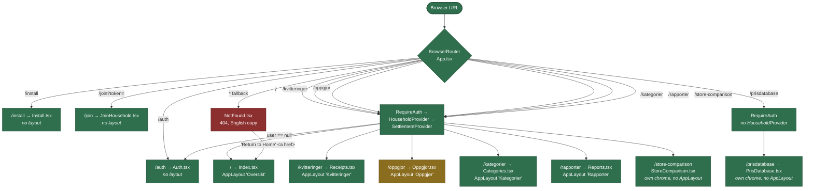
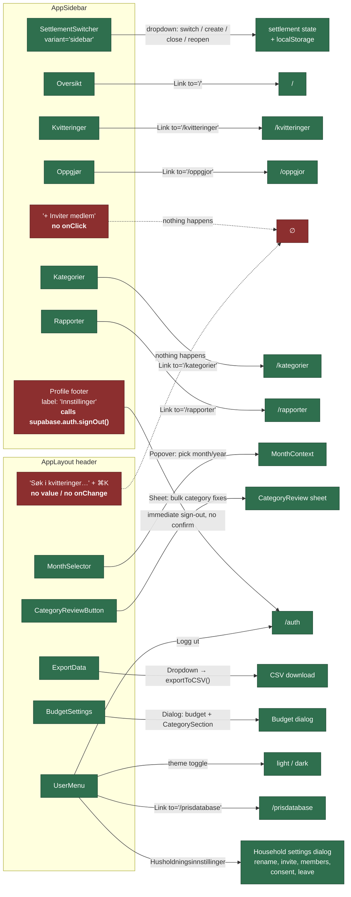
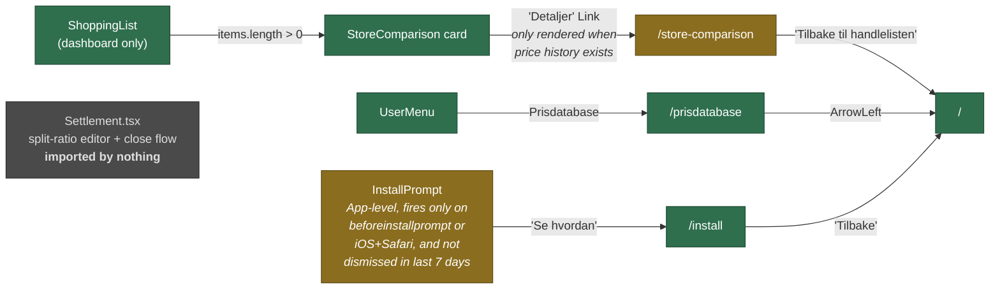
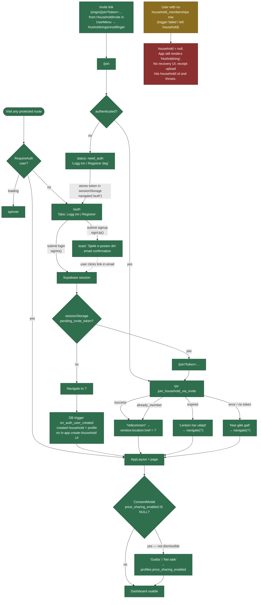
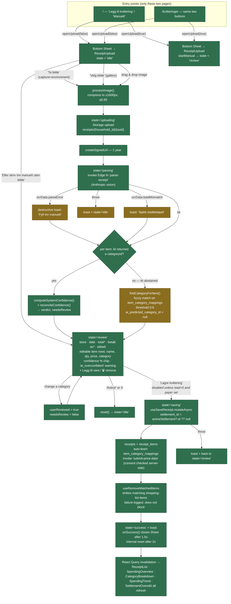
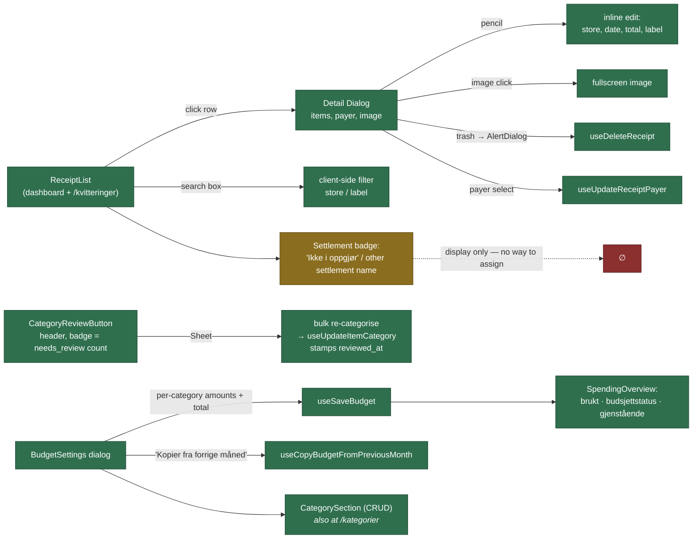
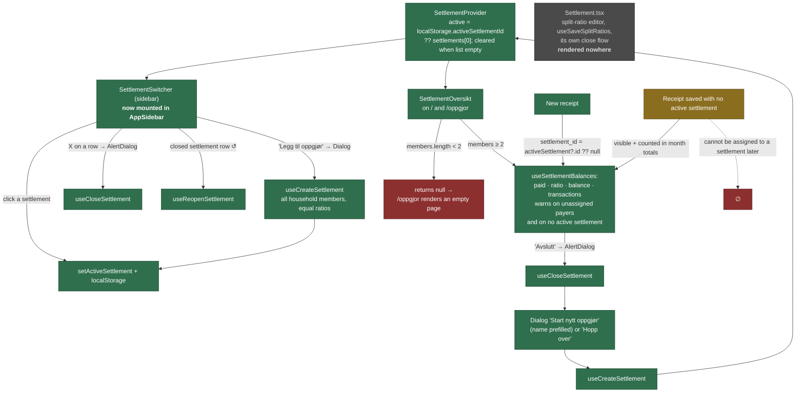

# BudgetBandz — actual user-facing wiring

Traced from the codebase on 2026-08-06 (branch `main`, HEAD `6b8e17f`). This documents
**what the code does**, not what the design intends. Where the two disagree, the code wins
and the gap is noted in [Issues found](#issues-found).

## Legend

| Colour | Meaning |
|---|---|
| 🟩 **green** | Works — reachable, has a handler, does what its label says |
| 🟨 **amber** | Works, but only under a condition that is easy to miss (conditional render, empty-state gate, hidden entry point) |
| 🟥 **red** | Broken, misleading, or a dead end — button with no handler, label that lies, page that renders nothing |
| ⬜ **grey** | Built but not reachable from any flow — orphaned component or unlinked route |

Edge labels are the actual trigger: a click handler, a `<Link to>`, a `<Navigate>`, a form
submit, or a redirect.

---

## 1. Navigation structure — routes and nav wiring

Every route in `src/App.tsx`, what actually renders, and how you get there.

### Sidebar and header — where each control actually goes

`AppSidebar` renders identically on desktop (fixed) and mobile (inside a `Sheet` drawer).

### Routes with no nav entry

---

## 2. Onboarding — auth, household, invite join

---

## 3. Receipt: scan → OCR → categorise → save

The upload `Sheet` lives in `AppLayout` and is opened through the `useReceiptUpload()`
context, so only the two pages that render a CTA can start the flow.

### After save — review, budget, corrections

---

## 4. Settlement (oppgjør)

---

## Issues found

Nothing below has been changed — this is a list, not a patch.

### Broken / misleading controls

1. **`AppSidebar` "+ Inviter medlem" has no `onClick`** — [AppSidebar.tsx:114](../src/components/AppSidebar.tsx#L114). Renders as a brand-coloured button under the member list and does nothing. The working invite UI is buried in UserMenu → Husholdningsinnstillinger → HouseholdInvite.
2. **Sidebar profile footer is labelled "Innstillinger" but signs you out** — [AppSidebar.tsx:152-167](../src/components/AppSidebar.tsx#L152). `onClick={() => supabase.auth.signOut()}`, no confirmation, no settings dialog. The most destructive control in the sidebar is the one whose label promises the least.
3. **Header search input is decorative** — [AppLayout.tsx:119-123](../src/components/AppLayout.tsx#L119). No `value`, no `onChange`, and the ⌘K hint has no key handler anywhere. A real search does exist, but it's the separate box inside `ReceiptList`.

### Dead ends

4. **`/oppgjor` renders an empty page for households with fewer than 2 members** — `SettlementOversikt` returns `null` at [SettlementOversikt.tsx:72](../src/components/SettlementOversikt.tsx#L72) and the page has no other content ([Oppgjor.tsx](../src/pages/Oppgjor.tsx)). You get a header and nothing else, with no explanation.
5. **A receipt with no settlement can never be assigned to one.** `ReceiptList` badges it "Ikke i oppgjør" ([ReceiptList.tsx:57-60](../src/components/ReceiptList.tsx#L57)) and the detail dialog offers store/date/total/label/payer edits but no settlement picker.
6. **No recovery if `household` is null.** `HouseholdProvider` sets it to null on a missing membership ([HouseholdContext.tsx:57-62](../src/contexts/HouseholdContext.tsx#L57)), the layout falls back to the string "Husholdning", and there is no create-or-join UI anywhere — household creation only happens via the `on_auth_user_created` DB trigger. `ReceiptUpload` then does `household!.id` at [ReceiptUpload.tsx:169](../src/components/ReceiptUpload.tsx#L169) and throws. Also reachable via "Forlat husholdning" in household settings.
7. **`NotFound` is outside the app shell and in English** — [NotFound.tsx](../src/pages/NotFound.tsx). "Oops! Page not found" / "Return to Home" in an otherwise Bokmål-only UI, no sidebar, and a plain `<a href="/">` that does a full page reload.

### Orphans and hard-to-reach entry points

8. **`Settlement.tsx` is imported by nothing** (confirmed by grep). 326 lines holding the split-ratio editor and its own close flow. The `TODO` in [Oppgjor.tsx](../src/pages/Oppgjor.tsx) explains why it's parked — it needs a decision, not a fix.
9. **`/store-comparison` has one conditional entry point.** The "Detaljer" link lives in the `StoreComparison` card ([StoreComparison.tsx:65](../src/components/StoreComparison.tsx#L65)), which only renders on the dashboard, only when the shopping list is non-empty, and only when `comparison.stores.length > 0` — the no-price-history branch returns early without the link. No sidebar entry.
10. **`/install` is reachable only through `InstallPrompt`**, which requires `beforeinstallprompt` (or iOS+Safari) and no dismissal in the last 7 days. Once dismissed, the route is only reachable by typing the URL.
11. **`/prisdatabase` and `/store-comparison` are not in `navItems`** — the sidebar lists five routes; these two are reachable only from UserMenu and the shopping list respectively.
12. **`InstallPrompt` says "Installer Food Buddy"** — [InstallPrompt.tsx:86](../src/components/InstallPrompt.tsx#L86). The app is BudgetBandz everywhere else; `Install.tsx` calls it "Budget App"; `Auth.tsx` calls it "Matbudsjett". Four names.

### Structural notes (not bugs, but they shape the map)

13. **`/prisdatabase` is the only authenticated route with no `HouseholdProvider`/`SettlementProvider`** ([App.tsx:91-98](../src/App.tsx#L91)). Fine today — the page queries `public_price_data` only — but any component added there that calls `useHousehold()` will throw.
14. **`/store-comparison` and `/prisdatabase` don't use `AppLayout`**, so they have no sidebar, no month selector, and no upload sheet — only a back arrow to `/`.
15. **The receipt-upload flow has exactly two entry points**, `/` and `/kvitteringer`. `/kategorier`, `/rapporter` and `/oppgjor` render no CTA even though `useReceiptUpload()` is available to them.

### CLAUDE.md is out of date on three points

- The known `/kvitteringer → <Index />` issue is **fixed** — `App.tsx` now maps each of the five sidebar routes to its own page component.
- `SettlementSwitcher` is described as "written but mounted nowhere"; it **is** mounted, in `AppSidebar` at [AppSidebar.tsx:81](../src/components/AppSidebar.tsx#L81), and it also handles create/close/reopen.
- `Settlement.tsx` mounted nowhere and the "no UI to assign a receipt to a settlement" gap are both still accurate.
