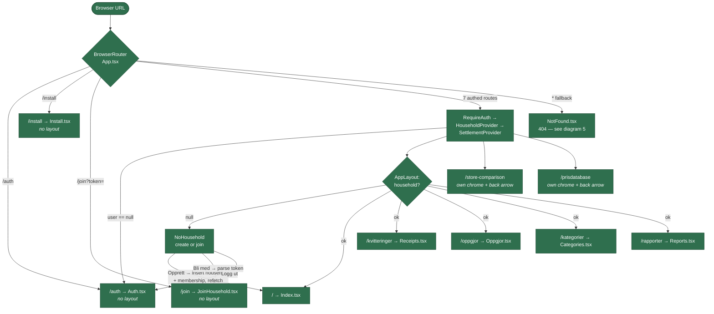
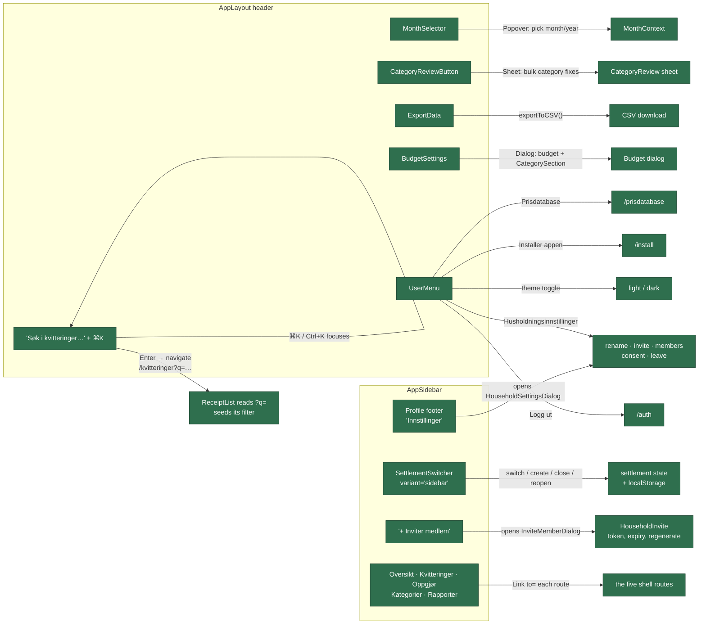
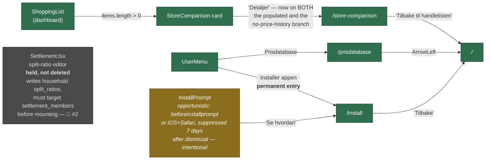
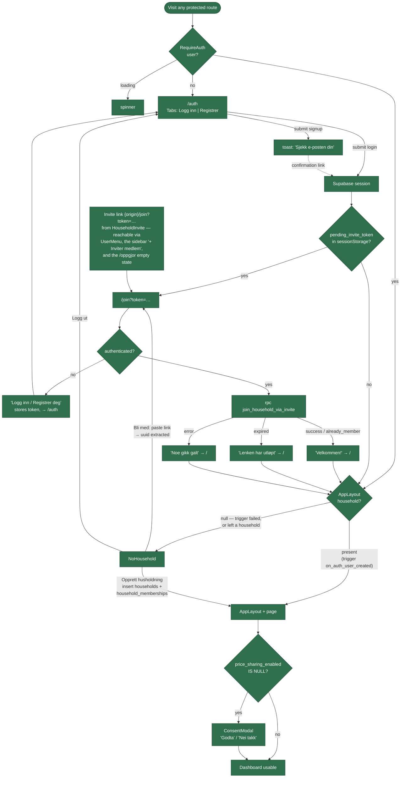
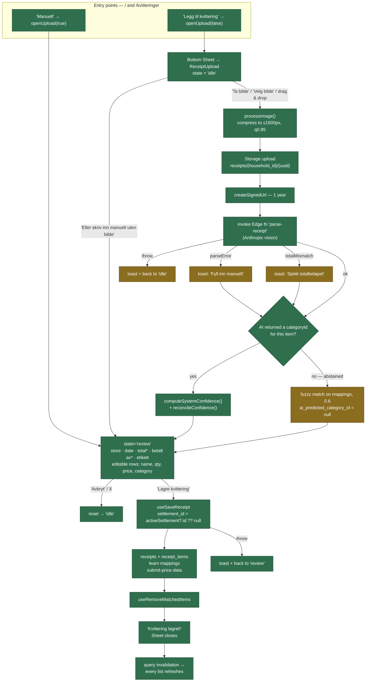
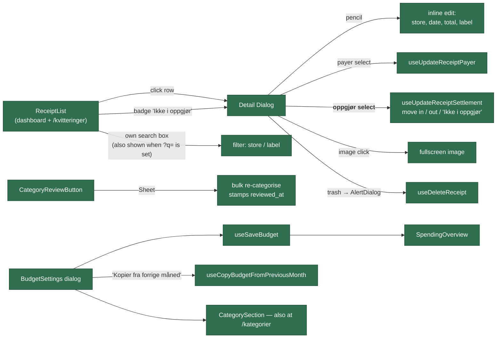
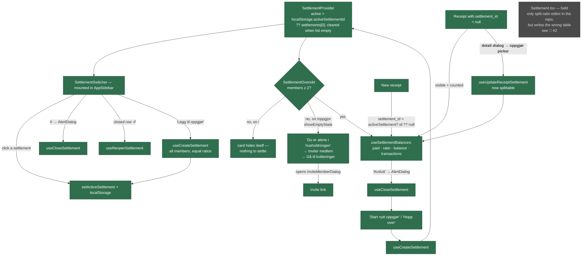
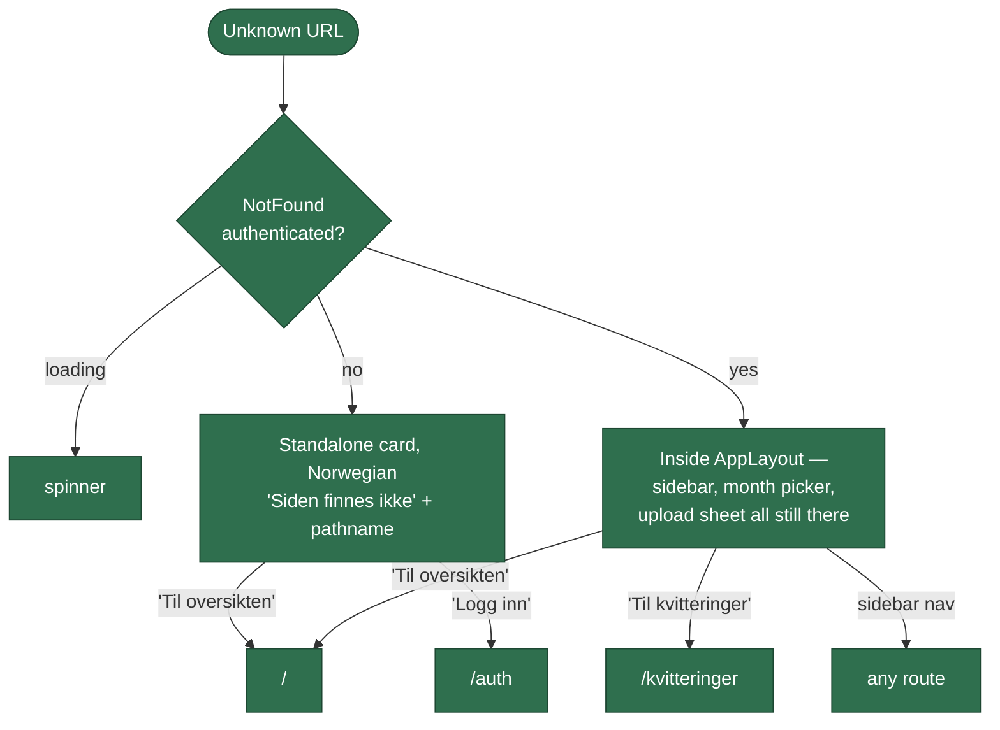

# BudgetBandz — actual user-facing wiring

Traced from the codebase, then **updated 2026-08-06 after the fixes on
`overnight-fixes`** (see [OVERNIGHT_LOG.md](../OVERNIGHT_LOG.md)). This documents **what the
code does**, not what the design intends. Where the two disagree, the code wins and the gap
is noted in [Issues](#issues--status).

## Legend

| Colour | Meaning |
|---|---|
| 🟩 **green** | Works — reachable, has a handler, does what its label says |
| 🟨 **amber** | Works, but only under a condition that is easy to miss (conditional render, empty-state gate, hidden entry point) |
| 🟥 **red** | Broken, misleading, or a dead end — button with no handler, label that lies, page that renders nothing |
| ⬜ **grey** | Built but not reachable from any flow — orphaned component or unlinked route |

Edge labels are the actual trigger: a click handler, a `<Link to>`, a `<Navigate>`, a form
submit, or a redirect.

**No red nodes remain.** The one grey node (`Settlement.tsx`) is a deliberate hold — see
[#8](#-deliberate-no-change).

---

## 1. Navigation structure — routes and nav wiring

Every route in `src/App.tsx`, what actually renders, and how you get there. All seven
authenticated routes now go through the same provider stack.

### Sidebar and header — where each control actually goes

### Routes outside the sidebar — all now have an entry point

---

## 2. Onboarding — auth, household, invite join

---

## 3. Receipt: scan → OCR → categorise → save

Unchanged by this round of fixes — it had no dead ends. Reproduced so the map stays whole.

### After save — review, budget, corrections

---

## 4. Settlement (oppgjør)

---

## 5. 404 and recovery states

---

## Issues — status

All 15 from the original mapping, plus one found during the work.

### ✅ Fixed

| # | Issue | Commit |
|---|---|---|
| 1 | `AppSidebar` "+ Inviter medlem" had no `onClick` | `498f8a1` |
| 2 | Sidebar footer labelled "Innstillinger" called `signOut()` | `498f8a1` |
| 3 | Header search input and ⌘K hint were decorative | `f924c16` |
| 4 | `/oppgjor` rendered blank for a household of one | `cc43aaf` |
| 5 | A settlement-less receipt could never be assigned | `1d0b542` |
| 6 | No recovery from a null `household` | `57a71c1` |
| 7 | `NotFound` outside the shell, in English | `0c5e0d9` |
| 9 | `/store-comparison` link missing from the empty branch | `ebc83b4` |
| 10 | `/install` had no permanent entry point | `91daebb` |
| 11 | Routes with no entry point in the UI | `91daebb` |
| 12 | Four product names in user-facing copy | `8b417c8` |
| 13 | `/prisdatabase` missing `HouseholdProvider` | `91daebb` |

### 📋 Deliberate, no change

**#8 `Settlement.tsx` — held, not deleted.** Not superseded: `SettlementSwitcher` and
`SettlementOversikt` cover switch/create/close/reopen, but the **split-ratio editor** exists
only here, and settlements currently get equal ratios with no UI to change them. It is also
not safe to mount as-is and says so in-file at
[Settlement.tsx:58](../src/components/Settlement.tsx#L58) — it reads balances from
`useSettlementBalances` but writes household-level `split_ratios`, which are only the
fallback once `settlement_members` rows exist. Deleting loses the only ratio editor;
mounting reintroduces a fixed bug. Pending 🔴 #2.

**#14 `/store-comparison` and `/prisdatabase` render without `AppLayout`.** They are focused
sub-pages with their own back arrow, not destinations needing a month picker.

**#15 The upload CTA appears only on `/` and `/kvitteringer`.** `useReceiptUpload()` is
available everywhere; the other three routes are views onto data, not places to add it.

### 🔴 New — needs a decision

**Leaving a household, and removing a member, silently do nothing.** Found while building
the #6 recovery screen. `household_memberships` has RLS enabled with only SELECT and INSERT
policies — no DELETE policy — so both operations affect zero rows, return no error, and toast
success. `useLeaveHousehold` also filters its delete on `household_id` alone with no
`user_id` predicate, so a DELETE policy added without a narrow enough `USING` clause would
let that statement remove every member of the household. Needs a permissions decision, a
migration, and a matching `.eq("user_id", …)`. See
[OVERNIGHT_LOG.md](../OVERNIGHT_LOG.md).
